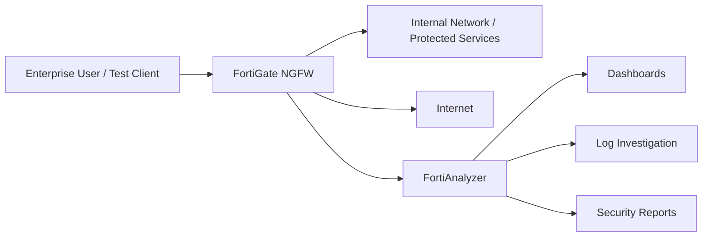

# Enterprise Network Security Monitoring and Threat Detection using FortiGate NGFW and FortiAnalyzer

This project demonstrates how an enterprise network can be monitored, protected, and investigated using **FortiGate Next-Generation Firewall (NGFW)** and **FortiAnalyzer**. The lab focuses on firewall policy enforcement, intrusion prevention, web filtering, centralized log collection, event analysis, and security reporting.

## Project Summary

The implementation uses FortiGate as the perimeter security control and FortiAnalyzer as the centralized logging, monitoring, and reporting platform. FortiGate inspects and controls traffic using firewall policies, IPS profiles, and web filtering rules. FortiAnalyzer receives logs from FortiGate, provides dashboards for operational visibility, and supports investigation through log search and reports.

## Objectives

- Configure FortiGate firewall policies for controlled enterprise traffic flow.
- Apply IPS inspection to detect scanning and suspicious network activity.
- Enable web filtering to block risky or non-business web categories.
- Forward FortiGate logs to FortiAnalyzer for centralized monitoring.
- Validate detection using an Nmap scan and blocked social networking access.
- Document alerting, investigation, reporting, and response workflows.

## Tools and Technologies

| Component | Purpose |
| --- | --- |
| FortiGate NGFW | Firewall policy enforcement, IPS, web filtering, traffic logging |
| FortiAnalyzer | Centralized logging, dashboards, investigation, reporting |
| FortiGuard Security Services | IPS signatures and web category intelligence |
| Nmap | Port scanning test traffic for detection validation |
| Ubuntu Client | Test endpoint used for traffic generation |

## Repository Contents

| Path | Description |
| --- | --- |
| [docs/project-report.md](docs/project-report.md) | Complete project report with screenshots and implementation narrative |
| [docs/detection-use-cases.md](docs/detection-use-cases.md) | Detection use cases, indicators, investigation steps, and response actions |
| [docs/incident-response-playbook.md](docs/incident-response-playbook.md) | Practical response workflow for FortiGate/FortiAnalyzer events |
| [docs/fortigate-fortianalyzer-checklist.md](docs/fortigate-fortianalyzer-checklist.md) | Configuration and validation checklist |
| [docs/presentation-outline.md](docs/presentation-outline.md) | Slide-by-slide presentation content |
| [configs/fortigate-baseline-notes.md](configs/fortigate-baseline-notes.md) | FortiGate baseline configuration notes and example policy logic |

## Evidence Screenshots

| Screenshot | Evidence |
| --- | --- |
| `01-firewall-policy-overview.png` | Firewall policy table |
| `02-firewall-policy-details.png` | Firewall policy settings |
| `03-ips-sensor-list.png` | IPS sensor list |
| `04-ips-sensor-configuration.png` | IPS sensor profile configuration |
| `05-fortianalyzer-log-settings.png` | FortiAnalyzer logging configuration |
| `06-fortianalyzer-dashboard.png` | FortiAnalyzer dashboard |
| `07-nmap-port-scan-detection.png` | Nmap scan validation |
| `08-web-filter-profile.png` | Web filter profile |
| `09-social-networking-block-rule.png` | Social networking block rule |
| `10-facebook-access-blocked.png` | Block page confirmation |
| `11-report-definitions.png` | FortiAnalyzer report definitions |

## High-Level Architecture

## Implemented Security Controls

- Firewall policies controlling client access to protected resources and the internet.
- IPS profile attached to traffic policy for threat inspection.
- Log forwarding from FortiGate to FortiAnalyzer.
- Web filter profile blocking social networking access.
- Detection validation using an Nmap scan against FortiAnalyzer.
- Reporting workflow prepared in FortiAnalyzer.

## Key Outcomes

- Centralized visibility was achieved through FortiAnalyzer dashboards and log views.
- FortiGate security profiles enforced policy-based blocking and inspection.
- Nmap scanning activity was generated and visible for investigation.
- Social networking traffic was blocked using FortiGuard web filtering.
- Report definitions were prepared for repeatable security review.

## Recommended Future Enhancements

- Add automated FortiAnalyzer event handlers for scan detection and web policy violations.
- Integrate email or ticketing notifications for high-severity alerts.
- Add SSL inspection for deeper web traffic visibility where policy and privacy requirements allow.
- Expand the detection catalog to include malware, brute force, data exfiltration, and command-and-control indicators.
- Create scheduled daily and weekly executive reports.
