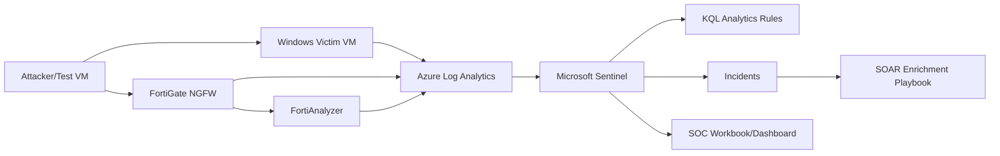

# MITRE ATT&CK-Based Detection Engineering and Automated SOC Response Lab

This project expands the existing FortiGate and FortiAnalyzer monitoring lab into a higher-impact SOC engineering project. It combines Microsoft Sentinel, Windows security logs, FortiGate/FortiAnalyzer telemetry, KQL analytics rules, MITRE ATT&CK mapping, and SOAR-style response documentation.

## Project Goal

Build a practical SOC lab that demonstrates the full detection lifecycle:

1. Generate controlled attack activity.
2. Collect logs from endpoint and network security tools.
3. Detect suspicious behavior using KQL.
4. Map detections to MITRE ATT&CK.
5. Investigate incidents in Microsoft Sentinel.
6. Enrich alerts with a response playbook.
7. Document evidence, timelines, and closure steps.

## Target Architecture

## Core Detections

| Detection | Log Source | MITRE Mapping |
| --- | --- | --- |
| Brute-force login attempts | Windows Security Events | T1110 - Brute Force |
| Suspicious PowerShell execution | Windows Process Creation / Sysmon | T1059.001 - PowerShell |
| Port scanning / network discovery | FortiGate or Sysmon network logs | T1046 - Network Service Discovery |
| Privilege escalation indicators | Windows Security Events | T1068 / T1078 |
| RDP lateral movement | Windows Security Events | T1021.001 - Remote Desktop Protocol |

## Folder Structure

| Path | Purpose |
| --- | --- |
| `detections/kql/` | Ready-to-use KQL detection rules |
| `docs/implementation-guide.md` | Step-by-step build guide |
| `docs/mitre-coverage-matrix.md` | ATT&CK mapping and coverage table |
| `docs/report-template.md` | Final report template for screenshots and evidence |
| `docs/screenshot-checklist.md` | Screenshots to capture while building |
| `playbooks/ip-reputation-enrichment.md` | SOAR enrichment playbook design |
| `screenshots/README.md` | Screenshot naming guide |
| `resume-bullets.md` | Resume-ready project bullets |

## Build Order

1. Create Microsoft Sentinel and Log Analytics workspace.
2. Connect Windows Security Events.
3. Generate controlled Windows login and PowerShell test activity.
4. Add the KQL rules from `detections/kql`.
5. Add FortiGate/FortiAnalyzer telemetry or document the existing FortiAnalyzer evidence.
6. Create the SOAR IP enrichment playbook.
7. Capture screenshots listed in `docs/screenshot-checklist.md`.
8. Complete `docs/report-template.md`.

## Safety Note

All attack simulation must be performed only inside systems you own or are explicitly authorized to test. Do not scan or attack public IPs or third-party systems.
