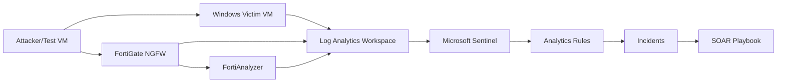

# Project Report Template

# MITRE ATT&CK-Based Detection Engineering and Automated SOC Response Lab

## Abstract

This project demonstrates a practical SOC detection engineering workflow using Microsoft Sentinel, FortiGate/FortiAnalyzer telemetry, Windows Security Events, KQL analytics rules, MITRE ATT&CK mapping, and SOAR-style incident enrichment. The lab validates detections through controlled attack simulation and documents the full alert lifecycle from log ingestion to incident response.

## Objectives

- Build a centralized monitoring lab using Microsoft Sentinel.
- Ingest Windows endpoint logs and FortiGate/FortiAnalyzer network telemetry.
- Develop custom KQL detections for common attack behaviors.
- Map detections to MITRE ATT&CK tactics and techniques.
- Validate detections through controlled lab activity.
- Create a SOAR enrichment playbook for incident context.
- Produce a professional SOC report with evidence screenshots.

## Architecture

Add architecture diagram or screenshot here.



## Tools Used

| Tool | Purpose |
| --- | --- |
| Microsoft Sentinel | SIEM, analytics rules, incidents, workbooks |
| Log Analytics | Log storage and KQL queries |
| FortiGate NGFW | Firewall and network security telemetry |
| FortiAnalyzer | FortiGate log analysis and reporting |
| Windows Security Events | Endpoint authentication and process activity |
| KQL | Detection engineering queries |
| Logic Apps | SOAR-style automation |
| Nmap | Controlled network scanning test |
| Atomic Red Team | Optional ATT&CK-based test execution |

## Detection 1: Brute-Force Login Attempts

### Objective

Detect repeated failed login attempts from the same source IP or against the same account.

### MITRE Mapping

- Tactic: Credential Access
- Technique: T1110 - Brute Force

### KQL Rule

Reference: `detections/kql/01-brute-force-logon.kql`

### Evidence

Add screenshots:

- Test failed logons.
- Sentinel query output.
- Analytics rule.
- Incident generated.

### Response

Validate source IP, confirm account owner, check successful logons after failures, reset credentials if needed, and block suspicious source IPs.

## Detection 2: Suspicious PowerShell Execution

### Objective

Detect PowerShell execution patterns commonly associated with malicious activity.

### MITRE Mapping

- Tactic: Execution
- Technique: T1059.001 - PowerShell

### KQL Rule

Reference: `detections/kql/02-suspicious-powershell.kql`

### Evidence

Add screenshots:

- Safe test command.
- Sentinel query output.
- Alert or incident.

## Detection 3: Port Scan / Service Discovery

### Objective

Detect network service discovery through multiple destination port probes.

### MITRE Mapping

- Tactic: Discovery
- Technique: T1046 - Network Service Discovery

### KQL Rule

Reference: `detections/kql/03-fortigate-port-scan.kql`

### Evidence

Add screenshots:

- Nmap test.
- FortiGate/FortiAnalyzer logs.
- Sentinel query result, if live ingestion is configured.

## Detection 4: Privilege Escalation Indicators

### Objective

Detect privileged logon events, new account creation, and administrative group changes.

### MITRE Mapping

- Tactic: Privilege Escalation
- Techniques: T1068, T1078

### KQL Rule

Reference: `detections/kql/04-privilege-escalation.kql`

## Detection 5: RDP Lateral Movement

### Objective

Detect remote interactive logons that may indicate lateral movement.

### MITRE Mapping

- Tactic: Lateral Movement
- Technique: T1021.001 - Remote Desktop Protocol

### KQL Rule

Reference: `detections/kql/05-rdp-lateral-movement.kql`

## SOAR Enrichment

Summarize the Logic Apps playbook:

```text
Incident created -> Extract IP -> Query reputation service -> Add comment -> Update incident
```

Add screenshots of:

- Playbook designer.
- HTTP enrichment action.
- Incident comment.

## Results

| Detection | Alert Created | Incident Created | MITRE Mapped | Evidence Captured |
| --- | --- | --- | --- | --- |
| Brute force | Pending | Pending | Yes | Pending |
| Suspicious PowerShell | Pending | Pending | Yes | Pending |
| Port scan | Pending | Pending | Yes | Pending |
| Privilege escalation | Pending | Pending | Yes | Pending |
| RDP lateral movement | Pending | Pending | Yes | Pending |

## Conclusion

This lab demonstrates an end-to-end SOC detection engineering workflow. It shows how log ingestion, custom KQL analytics, MITRE ATT&CK mapping, incident creation, and SOAR enrichment can be combined to improve threat detection and response.
