# Enterprise Network Security Monitoring and Threat Detection using FortiGate NGFW and FortiAnalyzer

## Abstract

Enterprise networks require continuous monitoring, policy enforcement, and rapid investigation of suspicious activity. This project implements a security monitoring lab using FortiGate NGFW and FortiAnalyzer. FortiGate provides firewall control, intrusion prevention, web filtering, and traffic logging. FortiAnalyzer collects and organizes security logs into dashboards, searchable events, and reports. The project validates monitoring by generating port scan traffic with Nmap and by testing a blocked social networking web category.

## Problem Statement

Organizations often struggle to identify policy violations, network scanning, and risky browsing activity when firewall logs are distributed or not reviewed consistently. Without centralized visibility, security teams may miss early indicators of compromise such as reconnaissance scans, repeated connection attempts, or blocked high-risk traffic. This project addresses that problem by combining FortiGate enforcement with FortiAnalyzer monitoring and reporting.

## Objectives

- Deploy FortiGate NGFW as the enforcement point for enterprise network traffic.
- Configure firewall policies that permit approved traffic and deny or inspect risky traffic.
- Attach IPS protection to detect suspicious network behavior.
- Enable FortiAnalyzer log forwarding for centralized visibility.
- Validate monitoring using controlled test traffic.
- Produce a repeatable investigation and reporting workflow.

## Lab Components

| Component | Role |
| --- | --- |
| FortiGate NGFW | Enforces firewall, IPS, and web filtering policies |
| FortiAnalyzer | Collects logs, provides dashboards, supports investigations and reports |
| Ubuntu test host | Generates test traffic such as Nmap scans and web requests |
| FortiGuard services | Provides IPS signatures and web category filtering |

## Network Monitoring Architecture

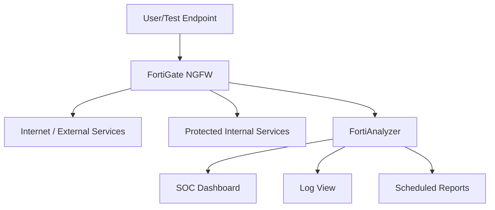

The FortiGate device acts as the control point for traffic inspection. It forwards traffic, security, and event logs to FortiAnalyzer. FortiAnalyzer then provides dashboards and reports that help analysts identify suspicious patterns, validate policy enforcement, and document security posture.

## Firewall Policy Configuration

The firewall policy defines how traffic is allowed, denied, inspected, and logged. In this lab, the policy was configured to control enterprise traffic and apply security inspection profiles.

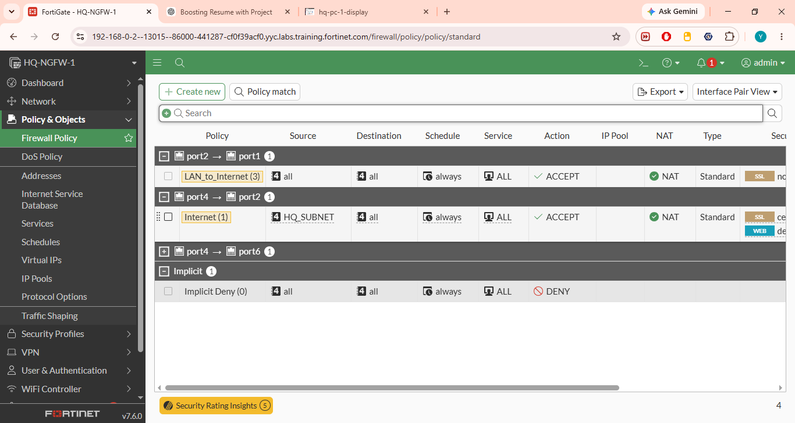

The policy overview confirms that firewall rules are configured and visible in the FortiGate policy table.

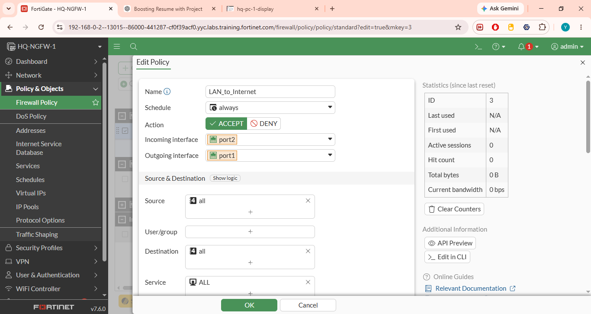

The detailed policy view confirms the traffic matching logic, interfaces, source/destination criteria, service selection, NAT behavior, and logging/security profile settings.

Important firewall policy design points:

- Use specific source and destination objects where possible.
- Avoid overly broad allow rules unless there is a documented business requirement.
- Enable logging for security-relevant policies.
- Attach IPS and web filtering profiles to user internet access policies.
- Review policy order because FortiGate processes policies from top to bottom.

## Intrusion Prevention Configuration

Intrusion Prevention System (IPS) profiles inspect network traffic for known attack signatures, scans, exploits, and protocol anomalies. This lab uses IPS inspection to support threat detection.

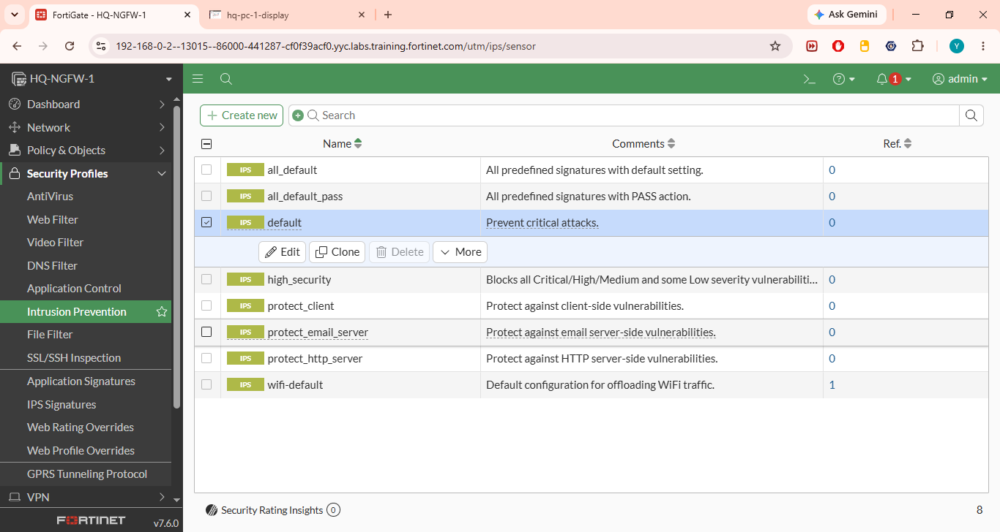

The IPS sensor list shows the available IPS profiles that can be applied to firewall policies.

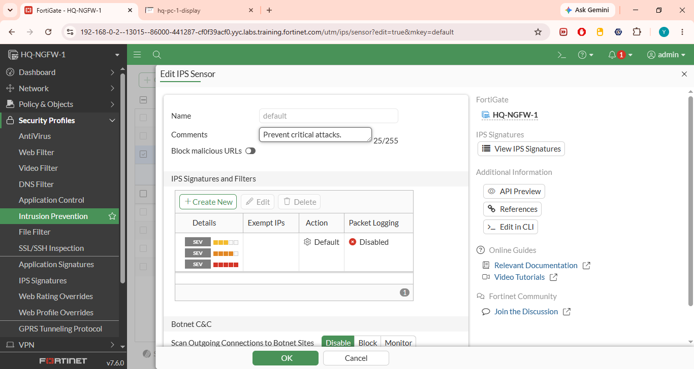

The IPS configuration confirms that inspection settings are enabled for the selected profile. Applying this IPS profile to the firewall policy allows FortiGate to detect and log suspicious activity.

Recommended IPS settings:

- Use monitor mode during initial tuning if blocking may interrupt business services.
- Move high-confidence signatures to block mode after validation.
- Prioritize critical and high-severity signatures.
- Review IPS logs regularly to tune false positives.
- Keep FortiGuard signatures updated.

## FortiAnalyzer Logging Configuration

Centralized log collection is essential for monitoring and investigation. FortiGate was configured to forward logs to FortiAnalyzer.

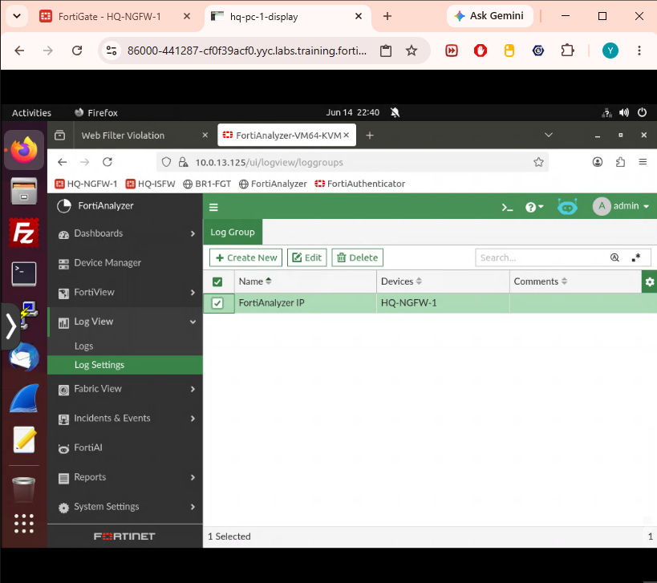

This confirms that FortiAnalyzer logging was enabled, allowing FortiGate logs to be collected centrally.

Logging best practices:

- Enable traffic logs for key allow and deny policies.
- Enable security event logs for IPS and web filtering.
- Synchronize system time using NTP so event timelines are accurate.
- Use meaningful device names and administrative domains where applicable.
- Define retention based on compliance and investigation requirements.

## FortiAnalyzer Dashboard

FortiAnalyzer dashboards provide a centralized view of system status, device activity, logs, and security events.

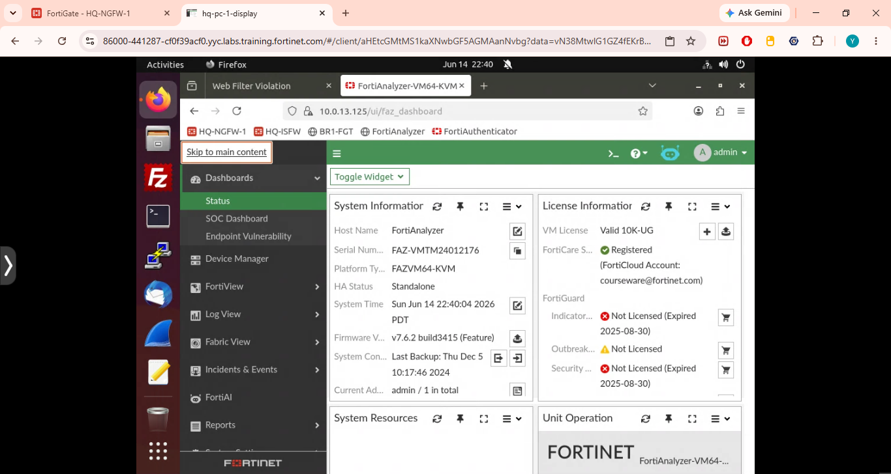

The dashboard confirms that FortiAnalyzer is available and ready for monitoring. Analysts can use dashboards to quickly review system status, event volume, policy violations, and threat activity.

## Detection Validation: Nmap Port Scan

To validate monitoring, an Nmap SYN scan was generated from the Ubuntu test endpoint against the FortiAnalyzer IP address.

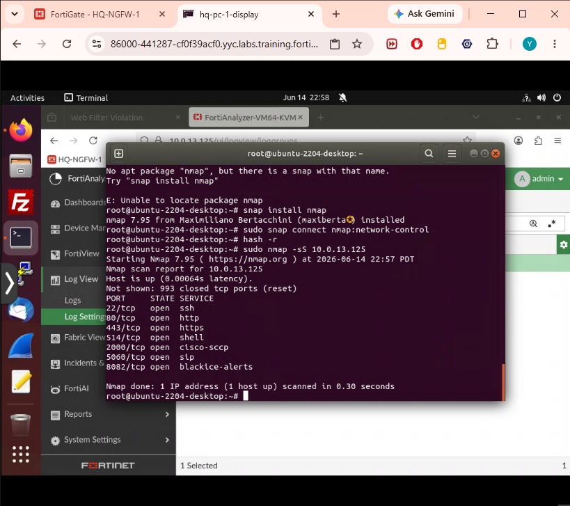

The test identified several open services on the target. In a production environment, scans like this may indicate reconnaissance activity. FortiGate and FortiAnalyzer can help detect, log, and investigate scan behavior when the traffic crosses monitored policy paths.

Observed services from the scan:

| Port | Service |
| --- | --- |
| 22/tcp | SSH |
| 80/tcp | HTTP |
| 443/tcp | HTTPS |
| 514/tcp | Shell |
| 2000/tcp | Cisco SCCP |
| 5060/tcp | SIP |
| 8082/tcp | BlackICE alerts |

Observed scan indicators:

- Multiple connection attempts to different ports.
- Short time window between connection attempts.
- Source endpoint performing service enumeration.
- Destination host receiving probes across administrative or application ports.

Recommended response:

- Confirm whether the source endpoint is authorized for scanning.
- Check FortiAnalyzer logs for repeated scan activity from the same source.
- Review destination asset criticality.
- Block or isolate the source if the scan is unauthorized.
- Document the event and tune detection rules if necessary.

## Web Filtering Configuration

Web filtering was configured to enforce acceptable-use controls and reduce access to risky or non-business web categories.

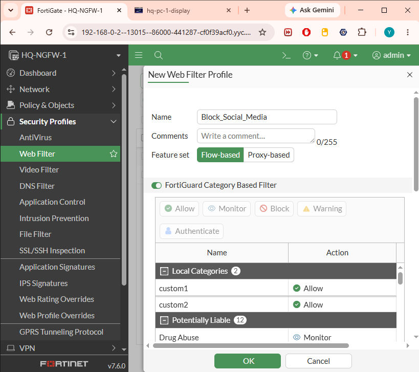

The web filter profile defines how FortiGate handles selected web categories and destinations.

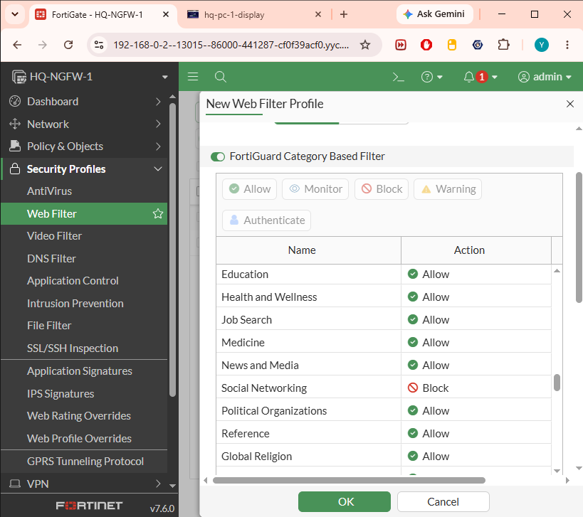

The rule confirms that social networking access was blocked as part of the web filtering policy.

## Web Filtering Validation

Access to Facebook was tested from the client system. FortiGate blocked the request and displayed a FortiGuard block page.

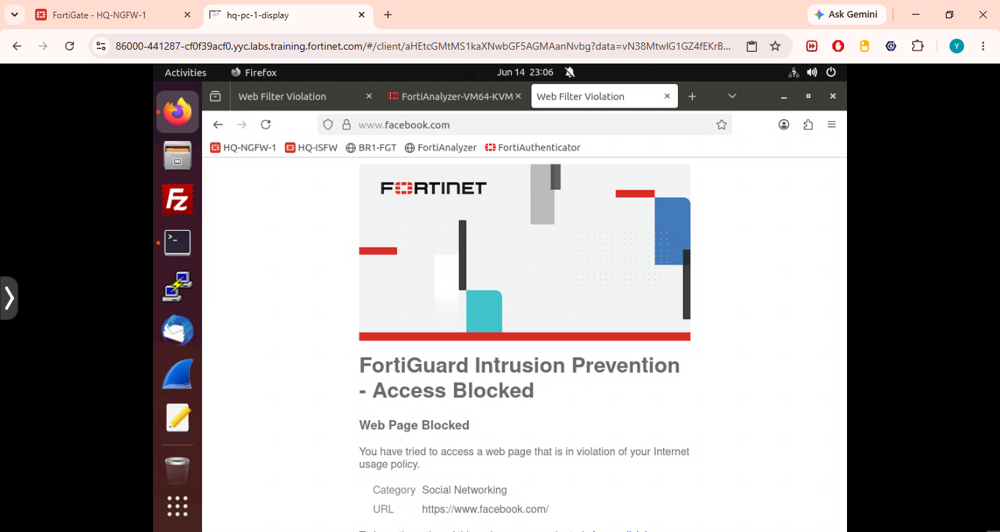

This validates that the web filtering policy was applied successfully and that user traffic was being inspected by FortiGate.

Security value:

- Enforces acceptable-use policy.
- Reduces exposure to high-distraction or risky categories.
- Creates auditable web access logs.
- Helps analysts identify repeated policy violations.

## Reporting

FortiAnalyzer reports allow security teams to generate repeatable summaries for operations, management, and compliance review.

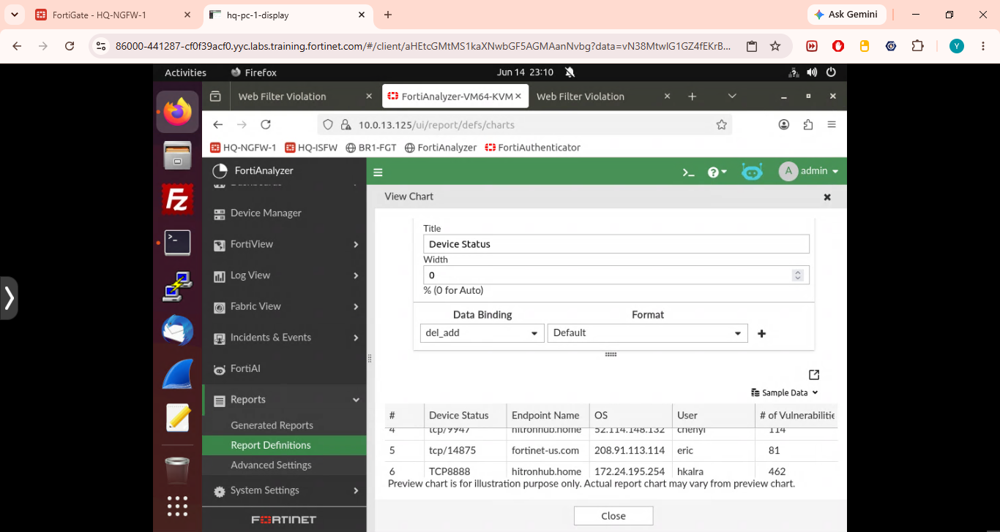

Report definitions can be used to generate scheduled summaries of traffic, threats, web usage, policy violations, and device health.

Recommended report types:

- Daily security event summary.
- Weekly top blocked web categories.
- Weekly top source and destination IPs.
- IPS event summary by severity.
- Firewall policy usage and denied traffic report.
- Monthly executive security posture report.

## Detection Use Cases

| Use Case | Data Source | Indicator | Response |
| --- | --- | --- | --- |
| Port scan / reconnaissance | Traffic logs, IPS logs | Multiple port probes from one source | Validate, block source, investigate endpoint |
| Web policy violation | Web filter logs | Blocked social networking category | Notify user/owner, review repeated attempts |
| Suspicious inbound service access | Traffic logs | Attempts to administrative ports | Block, restrict exposure, review asset |
| IPS signature match | IPS logs | High/critical signature event | Investigate payload, isolate source if needed |
| Repeated denied traffic | Deny logs | Many denied attempts from same source | Add block rule or upstream control |

## Incident Response Workflow

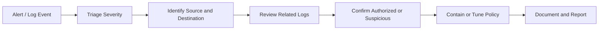

## Results

The lab successfully demonstrated:

- FortiGate firewall policy configuration.
- IPS profile preparation for inspection.
- FortiAnalyzer logging integration.
- FortiAnalyzer dashboard visibility.
- Nmap scan test generation.
- Web filtering enforcement against social networking access.
- Report definition preparation for ongoing monitoring.

## Limitations

- The lab environment contains a limited number of endpoints and services.
- Advanced automation such as event handlers and external ticketing integration was not configured.
- SSL deep inspection was not included.
- Detection validation focused on scanning and web filtering rather than malware, phishing, or data exfiltration.

## Future Scope

- Configure FortiAnalyzer event handlers for real-time alerting.
- Add email, webhook, or ticketing integration for critical alerts.
- Create automated block actions for repeated scan sources.
- Add SSL inspection in a controlled policy scope.
- Expand testing to brute-force attempts, malware download simulation, and DNS-based threats.
- Build compliance reports mapped to ISO 27001, NIST CSF, or internal security policy requirements.

## Conclusion

This project demonstrates how FortiGate NGFW and FortiAnalyzer can be used together to build an enterprise security monitoring workflow. FortiGate enforces access control and security inspection, while FortiAnalyzer centralizes visibility, investigation, and reporting. The Nmap and web filtering validation tests show that the environment can detect suspicious activity and enforce policy decisions, forming a practical foundation for a SOC monitoring workflow.
